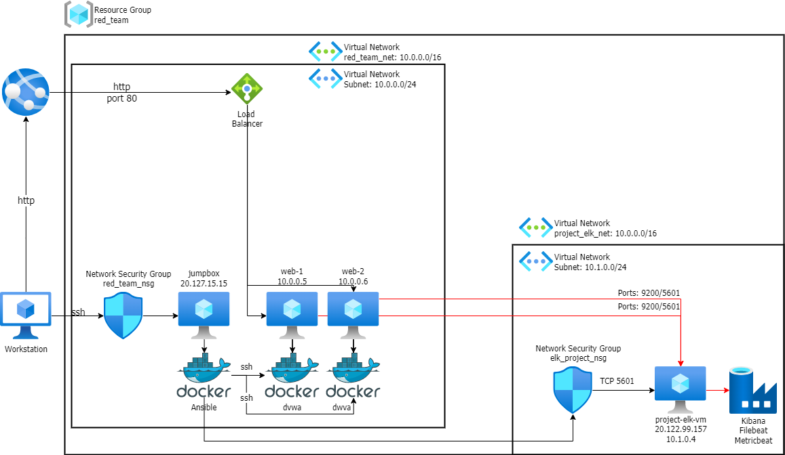
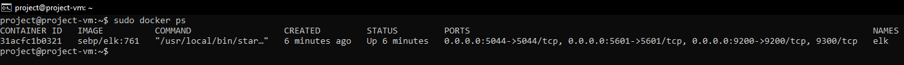
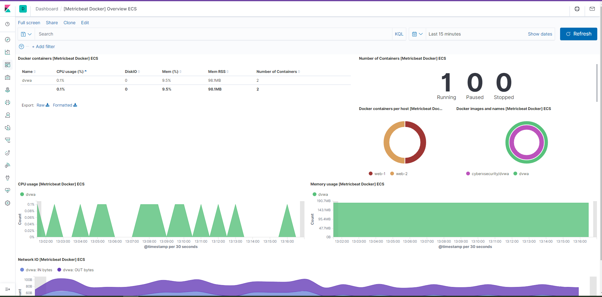

## Automated ELK Stack Deployment

The files in this repository were used to configure the network depicted below.

These files have been tested and used to generate a live ELK deployment on Azure. They can be used to either recreate the entire deployment pictured above. Alternatively, select portions of the config or yml files may be used to install only certain pieces of it, such as Filebeat.

  - [Ansible Config](https://github.com/AnthonyMaret/project13/blob/main/Ansible/ansible.cfg)
  - [Filebeat Config](https://github.com/AnthonyMaret/project13/blob/main/Ansible/filebeat-config.yml)
  - [Filebeat Playbook](https://github.com/AnthonyMaret/project13/blob/main/Ansible/filebeat-playbook.yml)
  - [Metricbeat Config](https://github.com/AnthonyMaret/project13/blob/main/Ansible/metricbeat-config.yml)
  - [Metricbeat Playbook](https://github.com/AnthonyMaret/project13/blob/main/Ansible/metricbeat-playbook.yml)

This document contains the following details:
- Description of the Topology
- Access Policies
- ELK Configuration
  - Beats in Use
  - Machines Being Monitored
- How to Use the Ansible Build

### Description of the Topology

The main purpose of this network is to expose a load-balanced and monitored instance of DVWA, the D*mn Vulnerable Web Application.

Load balancing ensures that the application will be highly available, in addition to restricting unauthorized connections to the network.
- What aspect of security do load balancers protect?
- Answer: Availability, load balancers distribute traffic. So in the case of one server failure, traffic can be rerouted to another.

- What is the advantage of a jump box?
- Answer: Another layer of security, which could be associated with the defense-in-depth model. Using a jumpbox seperates the local machine from the web servers, web-1 and web-2 in this case. Making them only available after being SSH'd in from the jumpbox.

Integrating an ELK server allows users to easily monitor the vulnerable VMs for changes to the data and system logs.
- What does Filebeat watch for?
- Answer: Filebeat watches for changes that have happened in the file system. It can detail what files have changed, and when.

- What does Metricbeat record?
- Answer: Metricbeat monitors system and service metrics running on your server, or servers. Examples can include Apache, MySQL, Nginx, and more.

The configuration details of each machine may be found below.

| Name    | Function           |              IP Address                  |  OS   |
|---------|--------------------|------------------------------------------|-------|
| jumpbox | Gateway            | Public: 20.127.15.15  Private: 10.0.0.4  | Linux |
| web-1   | Web Server         | Public: 20.25.13.5    Private: 10.0.0.5  | Linux |
| web-2   | Web Server         | Public: 20.25.13.5    Private: 10.0.0.6  | Linux |
| elk     | ELK Server         | Public: 20.122.99.157 Private: 10.1.0.4  | Linux |

### Access Policies

The machines on the internal network are not exposed to the public Internet. 

Only the ELK machine can accept connections from the Internet. Access to this machine is only allowed from the following IP addresses:
- Whitelisted IP addresses: The whitelisted IP address was my own local IP address, 98.31.39.159, through port 5601.

Machines within the network can only be accessed by the jumpbox.
- Which machine did you allow to access your ELK VM? What was its IP address?
- Answer: The only machine allowed to access the ELK VM was through the ansible container located in the jumpbox virtual machine. The ELK VM's public IP was 20.122.99.157, and it's private IP was 10.1.0.4.

A summary of the access policies in place can be found in the table below.

| Name          | Publicly Accessible | Allowed IP Addresses |
|---------------|---------------------|----------------------|
| Jumpbox       | Yes                 | 98.31.39.159         |
| web-1         | No                  | 10.0.0.4             |
| web-2         | No                  | 10.0.0.4             |
| elk           | Yes                 | 98.31.39.159         |
### Elk Configuration

Ansible was used to automate configuration of the ELK machine. No configuration was performed manually, which is advantageous because it keeps the process simple to understand, it's repeatable, and takes less time than configuring manually.
- What is the main advantage of automating configuration with Ansible?
- Answer: There are a couple of advantages of using automated configuration with Ansible. The main advantage I would say, would either be time or troubleshooting ease. Using automatic configuration instead of doing the work manually saves much needed time. Secondly, using the same static automatic configuration means that if there is ever troubleshooting that needs done, you only have to look at a single configuration, instead of multiple manual configurations. 

The playbook implements the following tasks:
- Explain the steps of the ELK installation play. E.g., install Docker; download image; etc.
- Installed docker.io, python3, and the docker pip3 module
- Increased the system's virtual memory, and then configured it to use the extra memory 
- Luanched the docker elk container, and configured it so that it ran on the ports 5601,9200 and 5044
- Enabled docker to start on boot

The following screenshot displays the result of running `docker ps` after successfully configuring the ELK instance.

### Target Machines & Beats
Below is a screenshot of the Metricbeat Dashboard on the Kibana website, showing successful connection to my web-1 and web-2 machines.

This ELK server is configured to monitor the following machines:
- List the IP addresses of the machines you are monitoring.
-  Answer: web-1: 10.0.0.5 web-2: 10.0.0.6

We have installed the following Beats on these machines:
- Specify which Beats you successfully installed.
-  Answer: Filebeat and Metricbeat

These Beats allow us to collect the following information from each machine:
- Explain what kind of data each beat collects, and provide 1 example of what you expect to see. E.g., `Winlogbeat` collects Windows logs, which we use to track user logon events, etc.
- Answer: Filebeat: Filebeat is responsible for forwarding and centralizing log data. It can monitor audit logs, deprecation logs, gc logs server logs, and slow logs. 
- Answer: Metricbeat: Metricbeat is responsible for collecting the metrics from your operating system and services running on the server. It can monitor services such as Apache, MySQL, Nginx, ect.

### Using the Playbook
In order to use the playbook, you will need to have an Ansible control node already configured. Assuming you have such a control node provisioned: 

SSH into the control node and follow the steps below:
- Copy the install-elk.yml file to your ansible container.
- Update the ____ file to include...
- Run the playbook, and navigate to ____ to check that the installation worked as expected.

Answer the following questions to fill in the blanks:
- Which file is the playbook? Where do you copy it?
- Answer:

- Which file do you update to make Ansible run the playbook on a specific machine? How do I specify which machine to install the ELK server on versus which to install Filebeat on?
- Answer:

- Which URL do you navigate to in order to check that the ELK server is running?
- Answer: http://public-elk-server-ip:5061/app/kibana

